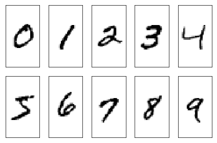
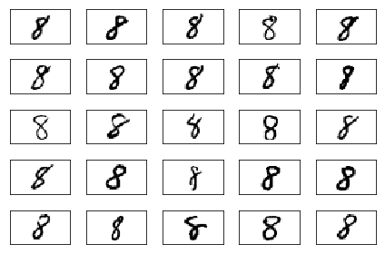

# 手写数字识别

## 1. 数据描述

[MNIST数据集](http://yann.lecun.com/exdb/mnist/)包含以下四个部分:

•训练集图片: train-images-idx3-ubyte.gz (9.9 MB, 47 MB unzipped, and 60,000 samples)

•训练集标签: train-labels-idx1-ubyte.gz (29 KB, 60 KB unzipped, and 60,000 labels)

•测试集图片: t10k-images-idx3-ubyte.gz (1.6 MB, 7.8 MB, unzipped and 10,000 samples)

•测试集标签: t10k-labels-idx1-ubyte.gz (5 KB, 10 KB unzipped, and 10,000 labels)

MNIST数据集来自美国国家标准与技术研究所 (NIST)的两个数据集. 测试集包括250个人书写的数字笔迹, 50% 高中生, 和50% 人口统计局的雇员.

## 2. 获取MNIST数据集


```python
from tensorflow.contrib.learn.python.learn.datasets.mnist import read_data_sets
mnist = read_data_sets("MNIST/", one_hot=True)
```

    D:\Anaconda\lib\site-packages\h5py\__init__.py:36: FutureWarning: Conversion of the second argument of issubdtype from `float` to `np.floating` is deprecated. In future, it will be treated as `np.float64 == np.dtype(float).type`.
      from ._conv import register_converters as _register_converters
    

    WARNING:tensorflow:From D:\Anaconda\lib\site-packages\tensorflow\contrib\learn\python\learn\datasets\base.py:198: retry (from tensorflow.contrib.learn.python.learn.datasets.base) is deprecated and will be removed in a future version.
    Instructions for updating:
    Use the retry module or similar alternatives.
    WARNING:tensorflow:From <ipython-input-1-78f50d2cb661>:2: read_data_sets (from tensorflow.contrib.learn.python.learn.datasets.mnist) is deprecated and will be removed in a future version.
    Instructions for updating:
    Please use alternatives such as official/mnist/dataset.py from tensorflow/models.
    WARNING:tensorflow:From D:\Anaconda\lib\site-packages\tensorflow\contrib\learn\python\learn\datasets\mnist.py:260: maybe_download (from tensorflow.contrib.learn.python.learn.datasets.base) is deprecated and will be removed in a future version.
    Instructions for updating:
    Please write your own downloading logic.
    WARNING:tensorflow:From D:\Anaconda\lib\site-packages\tensorflow\contrib\learn\python\learn\datasets\mnist.py:262: extract_images (from tensorflow.contrib.learn.python.learn.datasets.mnist) is deprecated and will be removed in a future version.
    Instructions for updating:
    Please use tf.data to implement this functionality.
    Extracting MNIST/train-images-idx3-ubyte.gz
    WARNING:tensorflow:From D:\Anaconda\lib\site-packages\tensorflow\contrib\learn\python\learn\datasets\mnist.py:267: extract_labels (from tensorflow.contrib.learn.python.learn.datasets.mnist) is deprecated and will be removed in a future version.
    Instructions for updating:
    Please use tf.data to implement this functionality.
    Extracting MNIST/train-labels-idx1-ubyte.gz
    WARNING:tensorflow:From D:\Anaconda\lib\site-packages\tensorflow\contrib\learn\python\learn\datasets\mnist.py:110: dense_to_one_hot (from tensorflow.contrib.learn.python.learn.datasets.mnist) is deprecated and will be removed in a future version.
    Instructions for updating:
    Please use tf.one_hot on tensors.
    Extracting MNIST/t10k-images-idx3-ubyte.gz
    Extracting MNIST/t10k-labels-idx1-ubyte.gz
    WARNING:tensorflow:From D:\Anaconda\lib\site-packages\tensorflow\contrib\learn\python\learn\datasets\mnist.py:290: DataSet.__init__ (from tensorflow.contrib.learn.python.learn.datasets.mnist) is deprecated and will be removed in a future version.
    Instructions for updating:
    Please use alternatives such as official/mnist/dataset.py from tensorflow/models.
    


```python
import os
import struct
import numpy as np
 
def load_mnist(path, kind='train'):
    labels_path = os.path.join(path, '%s-labels.idx1-ubyte' % kind)
    images_path = os.path.join(path, '%s-images.idx3-ubyte' % kind)
        
    with open(labels_path, 'rb') as lbpath:
        magic, n = struct.unpack('>II', lbpath.read(8))
        labels = np.fromfile(lbpath, dtype=np.uint8)

    with open(images_path, 'rb') as imgpath:
        magic, num, rows, cols = struct.unpack(">IIII", imgpath.read(16))
        images = np.fromfile(imgpath, dtype=np.uint8).reshape(len(labels), 784)
 
    return images, labels
```


```python
X_train, y_train = load_mnist('MNIST/', kind='train')
print('Rows: %d, columns: %d' % (X_train.shape[0], X_train.shape[1]))
```

    Rows: 60000, columns: 784
    


```python
X_test, y_test = load_mnist('MNIST/', kind='t10k')
print('Rows: %d, columns: %d' % (X_test.shape[0], X_test.shape[1]))
```

    Rows: 10000, columns: 784
    

## 3. 查看手写数据


```python
%matplotlib inline
import matplotlib.pyplot as plt

fig, ax = plt.subplots(nrows=2, ncols=5, sharex=True, sharey=True,)
ax = ax.flatten()
for i in range(10):
    img = X_train[y_train == i][0].reshape(28, 28)
    ax[i].imshow(img, cmap='Greys', interpolation='nearest')

ax[0].set_xticks([])
ax[0].set_yticks([])
plt.tight_layout()
plt.show()
```





```python
fig, ax = plt.subplots(nrows=5, ncols=5, sharex=True, sharey=True,)
ax = ax.flatten()
for i in range(25):
    img = X_train[y_train == 8][i].reshape(28, 28)
    ax[i].imshow(img, cmap='Greys', interpolation='nearest')

ax[0].set_xticks([])
ax[0].set_yticks([])
plt.tight_layout()
plt.show()
```





```python
import tensorflow as tf
sess = tf.InteractiveSession()
```

# 4. Softmax 回归

创建占位符


```python
x = tf.placeholder("float", shape=[None, 784])
y_ = tf.placeholder("float", shape=[None, 10])
```

定义权重和偏移


```python
W = tf.Variable(tf.zeros([784,10]))
b = tf.Variable(tf.zeros([10]))

sess.run(tf.global_variables_initializer())
```

Lost function


```python
y = tf.nn.softmax(tf.matmul(x,W) + b)
```


```python
cross_entropy = -tf.reduce_sum(y_*tf.log(y))
```

训练模型


```python
train_step = tf.train.GradientDescentOptimizer(0.01).minimize(cross_entropy)
```


```python
for i in range(1000):
  batch = mnist.train.next_batch(50)
  train_step.run(feed_dict={x: batch[0], y_: batch[1]})
```

模型评估


```python
correct_prediction = tf.equal(tf.argmax(y,1), tf.argmax(y_,1))
```


```python
accuracy = tf.reduce_mean(tf.cast(correct_prediction, "float"))
```


```python
print(accuracy.eval(feed_dict={x: mnist.test.images, y_: mnist.test.labels}))
```

    0.8913
    

# 5. 多层卷积网络

初始化


```python
def weight_variable(shape):
  initial = tf.truncated_normal(shape, stddev=0.1)
  return tf.Variable(initial)

def bias_variable(shape):
  initial = tf.constant(0.1, shape=shape)
  return tf.Variable(initial)
```

卷积和数据合并


```python
def conv2d(x, W):
  return tf.nn.conv2d(x, W, strides=[1, 1, 1, 1], padding='SAME')

def max_pool_2x2(x):
  return tf.nn.max_pool(x, ksize=[1, 2, 2, 1],
                        strides=[1, 2, 2, 1], padding='SAME')
```

First layer  


```python
W_conv1 = weight_variable([5, 5, 1, 32])
b_conv1 = bias_variable([32])
```


```python
x_image = tf.reshape(x, [-1,28,28,1])
```


```python
h_conv1 = tf.nn.relu(conv2d(x_image, W_conv1) + b_conv1)
h_pool1 = max_pool_2x2(h_conv1)
```

Second layer


```python
W_conv2 = weight_variable([5, 5, 32, 64])
b_conv2 = bias_variable([64])

h_conv2 = tf.nn.relu(conv2d(h_pool1, W_conv2) + b_conv2)
h_pool2 = max_pool_2x2(h_conv2)
```

Fully connected layer


```python
W_fc1 = weight_variable([7 * 7 * 64, 1024])
b_fc1 = bias_variable([1024])

h_pool2_flat = tf.reshape(h_pool2, [-1, 7*7*64])
h_fc1 = tf.nn.relu(tf.matmul(h_pool2_flat, W_fc1) + b_fc1)
```

Apply Dropout to reduce the overfitting


```python
keep_prob = tf.placeholder("float")
h_fc1_drop = tf.nn.dropout(h_fc1, keep_prob)
```

Output layer


```python
W_fc2 = weight_variable([1024, 10])
b_fc2 = bias_variable([10])

y_conv=tf.nn.softmax(tf.matmul(h_fc1_drop, W_fc2) + b_fc2)
```

训练， 评估模型


```python
cross_entropy = -tf.reduce_sum(y_*tf.log(y_conv))
train_step = tf.train.AdamOptimizer(1e-4).minimize(cross_entropy)
correct_prediction = tf.equal(tf.argmax(y_conv,1), tf.argmax(y_,1))
accuracy = tf.reduce_mean(tf.cast(correct_prediction, "float"))
sess.run(tf.global_variables_initializer())

for i in range(10000):
  batch = mnist.train.next_batch(50)
  if i%500 == 0:
    train_accuracy = accuracy.eval(feed_dict={x:batch[0], y_: batch[1], keep_prob: 1.0})
    print("step %d, training accuracy %g"%(i, train_accuracy))
  train_step.run(feed_dict={x: batch[0], y_: batch[1], keep_prob: 0.5})

print("test accuracy %g"%accuracy.eval(feed_dict={x: mnist.test.images, y_: mnist.test.labels, keep_prob: 1.0}))
```

    step 0, training accuracy 0.06
    step 500, training accuracy 0.88
    step 1000, training accuracy 0.96
    step 1500, training accuracy 0.98
    step 2000, training accuracy 0.94
    step 2500, training accuracy 0.98
    step 3000, training accuracy 0.98
    step 3500, training accuracy 1
    step 4000, training accuracy 1
    step 4500, training accuracy 0.94
    step 5000, training accuracy 1
    step 5500, training accuracy 1
    step 6000, training accuracy 0.98
    step 6500, training accuracy 1
    step 7000, training accuracy 1
    step 7500, training accuracy 1
    step 8000, training accuracy 0.96
    step 8500, training accuracy 1
    step 9000, training accuracy 1
    step 9500, training accuracy 1
    test accuracy 0.9901
    
